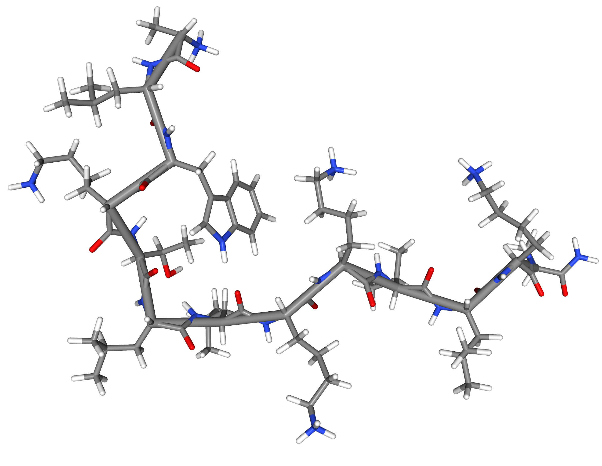

[ Source code](https://github.com/sayalaruano/CapstoneProject-MLZoomCamp){.btn target=_blank} [ Web application](https://ampredst.streamlit.app/){.btn target=_blank}

I developed this project as the Capstone assignment for the [Machine Learning Zoomcamp][zoomcamp]. It was an end-to-end project with data pre-processing, feature engineering, training, hyperparameter tuning, and deployment of the best model as a web application with Streamlit.

  

::: {.gray-italic .center-text}
**Figure 1.-** 3D-structure of an antimicrobial peptide.
:::

## Background

[Antimicrobial peptides][amp_wiki] (AMPs) are small bioactive drugs, commonly with fewer than 50 amino acids, which have appeared as promising compounds to control infectious disease caused by multi-drug resistant bacteria or superbugs. These superbugs are not treatable with the available drugs because of the development of some mechanisms to avoid the action of these compounds, which is known as antimicrobial resistance (AMR). According to the World Health Organization, AMR is one of the [top ten global public health threats facing humanity in this century][who_amr], so it is important to search for AMPs that combat these superbugs and prevent AMR.

However, the search for AMPs to combat superbugs by experimental methods is unfeasible because of the huge number of these compounds. So, it is required to explore other methods for handling this problem, and machine learning models could be great candidates for this task. Thus, in this project, I created some machine learning binary classifiers to predict the activity of antimicrobial peptides.

For this work, I took as a reference the [notebook][notebook] and [video][video] from [Dataprofessor][dataprofessor]. Also, the datasets, some ideas and reference datasets to compare the performance of the best model were obtained from this [article][article].

## Dataset

The [dataset][dataset] for this project consists of text files (in FASTA format) with sequences of active and non-active AMPs. The active AMPs were obtained by experimental assays, while the non-active peptides were derived from computational methods. The following table summarizes the dataset partitions and the number of instances in each one.

 

|Dataset partition|Size|AMPs|non-AMPs|
|:-:|---|---|---|
|Training|19548|9781|9767|
|Test|4656|2095|2561|
|External|13888|3117|10771|

 

AMPs can have more than one activity, including antibacterial, antifungal, antiparasitic, antiviral, among others. Training and Test partitions have active AMPs with a single activity, while the external partition has AMPs with more than one activity and it represents a real scenario of virtual screening with much more non-active AMPs than the active ones. You can find more details about these datasets in this [article][article].

Also, I chose these benchmark datasets to compare the performance metrics of our best models with the results of other methods reported in this [article][article].

## Data preparation and feature matrix

The feature matrices to train machine learning models were obtained by calculating some molecular features from the amino acid sequences of AMPs. These features were obtained with the [Pfeature][pfeature] Python library.

For this work, I calculated ten features that require only input and output files as parameters. These features are summarized in the table below.

 

|Feature class|Description|Python Function|
|---|---|---|
|AAC|Amino acid composition|aac_wp|
|ABC|Atom and bond composition|atc_wp, btc_wp|
|PCP|Physico-chemical properties|pcp_wp|
|RRI|Repetitive Residue Information|rri_wp|
|DDR|Distance distribution of residues|ddr_wp|
|SEP|Shannon entropy|sep_wp|
|SER|Shannon entropy of residue level|ser_wp|
|SPC|Shannon entropy of physicochemical property|spc_wp|
|CTC|Conjoint Triad Calculation|ctc_wp|
|CTD|Composition enhanced transition distribution|ctd_wp|

 

To know the details of these features and the entire Python library, you can read the [Pfeature Manual][pfeature_manual].

Also, I used the [CD-HIT][cdhit] software to remove the redundant sequences of the AMPs.

## Machine Learning Models

First, I tested more than 30 ML binary classifiers using the [LazyPredict][lazypredict] Python library. I chose the best models according to some performance metrics such as accuracy, ROC AUC, precision, recall, F1 score, and Matthews Correlation Coefficient (MCC). Then, I fine-tuned the hyperparameters of the best models using sklearn's class [GridSearchCV][gridsearchcv]. Finally, considering the results of hyperparameter tuning and performance metrics, I obtained the best ML model to predict AMPs activity.

## Results of the best ML model

The best model was ExtraTreesClassifier with `max_depth` of 50 and `n_estimators` of 200 as hyperparameters (the others were set as default), and `Amino acid Composition` (aac_wp) as feature matrix.

The performance metrics of this model on test and external datasets are presented below.

 

|Performance metric|Test dataset|External dataset|
|---|---|---|
|ROC AUC|0.90|0.90|
|Accuracy|0.90|0.92|
|Precision|0.94|0.79|
|Recall|0.85|0.86|
|F1score|0.89|0.82|
|MCC|0.81|0.77|

 

According to the evaluation results of our best model on test and external datasets, it is performing quite well. This [article][article] evaluated many the state of the art ML models for predicting AMPs using the same test and external datasets, and surprisingly the performance metrics of our model are very close to the results of the best ML models reported on this study.

## Web application
Using the best ML model, I created [AMPredST][ampredst], a web application that allows users to predict the antimicrobial activity and general properties of AMPs. The code for this web application is available in this [GitHub repository][ampredst_github]. 

  

## Additional information
The complete information regarding the exploratory data analysis and selection of the best model, training and validation python scripts, hypterparameter tuning, and further details are available on the [GitHub repository][capstone_github] of this project.

[zoomcamp]: https://github.com/alexeygrigorev/mlbookcamp-code
[amp_wiki]: https://en.wikipedia.org/wiki/Antimicrobial_peptides
[who_amr]: https://www.who.int/news-room/fact-sheets/detail/antimicrobial-resistance
[notebook]: https://github.com/dataprofessor/peptide-ml
[video]: https://www.youtube.com/watch?v=0NrFIGLwW0Q&feature=youtu.be
[dataprofessor]: https://github.com/dataprofessor
[article]: https://pubs.acs.org/doi/10.1021/acs.jcim.1c00251
[dataset]: https://biocom-ampdiscover.cicese.mx/dataset
[pfeature]: https://github.com/raghavagps/Pfeature
[pfeature_manual]: https://webs.iiitd.edu.in/raghava/pfeature/Pfeature_Manual.pdf
[cdhit]: https://github.com/weizhongli/cdhit
[lazypredict]: https://github.com/shankarpandala/lazypredict
[gridsearchcv]: https://scikit-learn.org/stable/modules/generated/sklearn.model_selection.GridSearchCV.html#sklearn.model_selection.GridSearchCV
[ampredst]: https://ampredst.streamlit.app/
[ampredst_github]: https://github.com/sayalaruano/AMPredST
[capstone_github]: https://github.com/sayalaruano/CapstoneProject-MLZoomCamp
