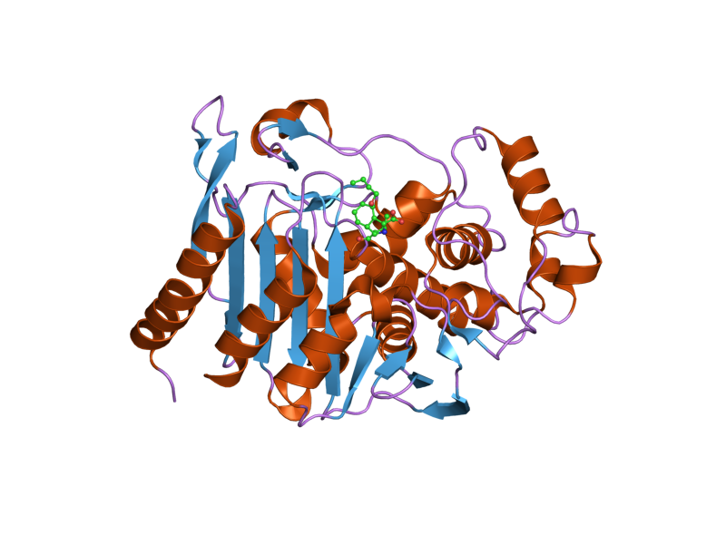

[ Source code](https://github.com/sayalaruano/MidtermProject-MLZoomCamp){.btn target=_blank}

I developed this project as the Midterm assignment for the [Machine Learning Zoomcamp][ml_zoomcamp]. [Data Professor][data_professor] proposed the idea and dataset of this project.

  

::: {.gray-italic .center-text}
**Figure 1.-** 3D-structure of a betalactamase (PDB ID: 2q9n). Retrieved from [Wikimedia Commons][wikimedia].
:::

## Background

This project aims to evaluate the activity of molecules that have been experimentally tested to bind or not bind to [Beta-Lactamases][beta_lactamase]. Some of these proteins allow multi-drug resistant bacteria or superbugs to inactivate a wide range of penicillin-like antibiotics, which is known as antimicrobial resistance (AMR). According to the World Health Organization, AMR is one of the [top ten global public health threats facing humanity in this century][who_amr], so it is important to search for potential compounds that combat these superbugs and prevent AMR, which is the aim of this project. You can find detailed information about AMR and Beta-Lactamase in this [blog][pdb_blog].

## Dataset

The [dataset][dataset_kaggle] of this project consists of 136 csv files with information on interactions between small molecules and Beta-Lactamases.

## Data preparation and feature matrix

The feature matrix to train machine learning models was obtained by calculating molecular descriptors from the `canonical smiles` of molecules. These molecular descriptors are also known as molecular fingerprints, and they are property profiles of molecules, represented as vectors with each vector element representing the existence or the frequency of a structural feature. The extraction of molecular fingerprints from SMILES was performed with [PaDEL][padel] software, following instructions from [this video][video_padel].

PaDEL has 12 available fingerprints, but for this project, I calculated 10 of them because KlekotaRothFingerprintCount and KlekotaRothFingerprinter required a long computing time to be obtained. In this project, the target protein was **Beta-lactamase AmpC**.

## Machine Learning Models

For this project, I tested three machine learning models, including Logistic Regression, Random Forest, and XGBoost, for a binary classification task. I chose `pchembl value` as the target variable. To fine-tune hyperparameters, I used sklearn class [GridSearchCV][gridsearchcv].

## Additional information

The complete information regarding exploratory data analysis and selection of the best model jupyter notebook, training and validation python scripts, implementation of the best model as a web service using Flask, deployment to the cloud with Heroku, and further details are available on the [GitHub repository][github_repo] of this project.

[ml_zoomcamp]: https://github.com/alexeygrigorev/mlbookcamp-code
[data_professor]: https://github.com/dataprofessor
[wikimedia]: https://commons.wikimedia.org/wiki/File:PDB_2q9n_EBI.png
[beta_lactamase]: https://en.wikipedia.org/wiki/Beta-lactamase
[who_amr]: https://www.who.int/news-room/fact-sheets/detail/antimicrobial-resistance
[pdb_blog]: https://pdb101.rcsb.org/motm/187
[dataset_kaggle]: https://www.kaggle.com/thedataprof/betalactamase
[padel]: http://www.yapcwsoft.com/dd/padeldescriptor/
[video_padel]: https://youtu.be/rEmDyZHz5U8
[gridsearchcv]: https://scikit-learn.org/stable/modules/generated/sklearn.model_selection.GridSearchCV.html#sklearn.model_selection.GridSearchCV
[github_repo]: https://github.com/sayalaruano/MidtermProject-MLZoomCamp
