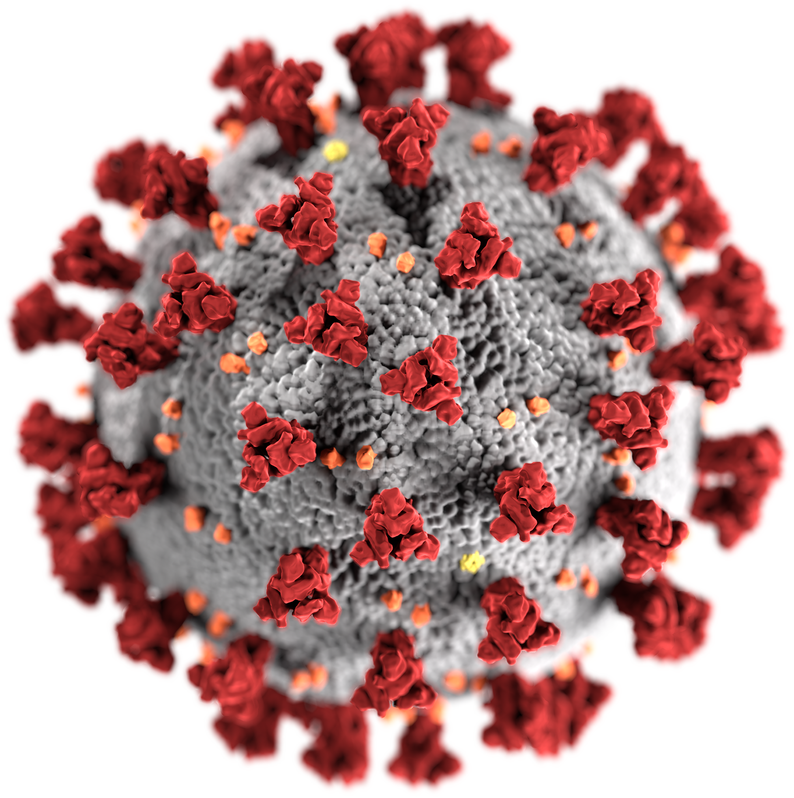
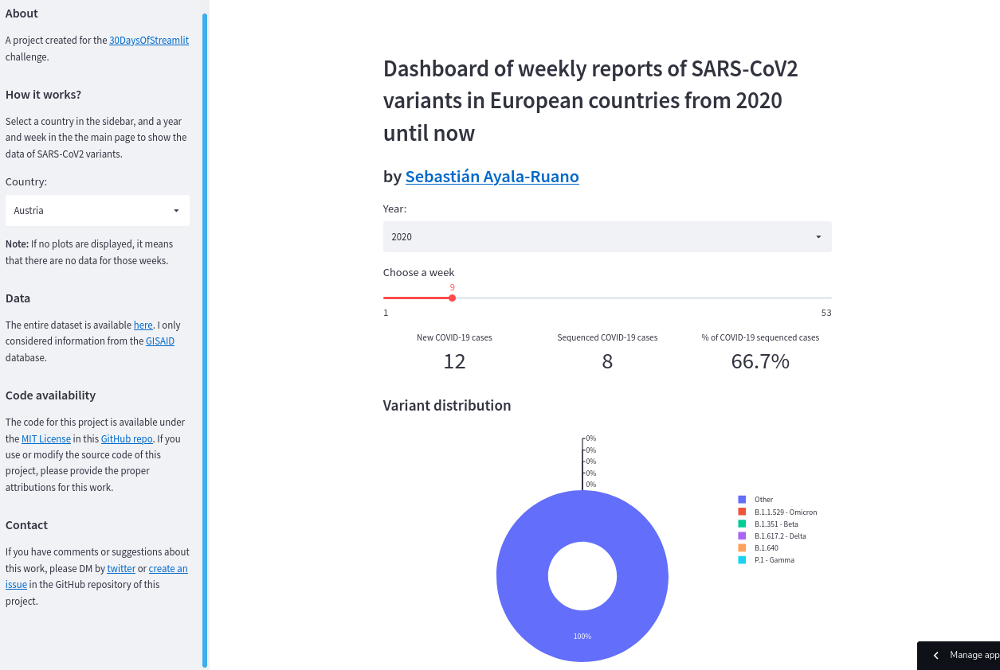

[ Source code](https://github.com/sayalaruano/Dashboard_SARS-CoV2_variants_Europe){.btn target=_blank} [ Web application](https://sars-cov2-eu-countries-report.streamlit.app/){.btn target=_blank}

I created this dashboard for the [30DaysOfStreamlit][30days] challenge using the [Streamlit][streamlit] Python package.

  

::: {.gray-italic .center-text}
**Figure 1.-** SARS-CoV-2 illustration. Retrieved from [Wikimedia Commons][wikimedia] and used under a CC0 licence.
:::

## Summary
The dashboard shows the weekly reports of SARS-CoV2 variants in European countries since January 2020 until April 2022. The user can select a country in the sidebar, and a year and week in the main page to show the available data of SARS-CoV2 variants from the selected country. Information about the number of cases, sequenced genomes, and the percentage of the different variants are displayed in tables and plots.

The screenshot below shows how the dashboard looks like:

  

## Dataset 

The entire dataset is available [here][dataset]. I only considered information from the [GISAID][gisaid] database.

## Additional information
The complete information regarding this project is available on this [GitHub repository][github].
 
[gisaid]: https://www.gisaid.org/
[30days]: https://share.streamlit.io/streamlit/30days
[streamlit]: https://streamlit.io/
[wikimedia]: https://commons.wikimedia.org/wiki/File:SARS-CoV-2_without_background.png
[dataset]: https://www.ecdc.europa.eu/en/publications-data/data-virus-variants-covid-19-eueea
[github]: https://github.com/sayalaruano/Dashboard_SARS-CoV2_variants_Europe
