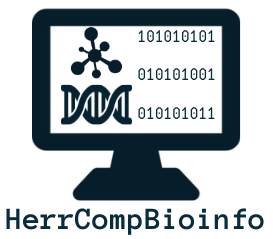

[ E-book](https://rsg-ecuador.github.io/HerrCompBioinfo/Bienvenida.html){.btn target=_blank} [ Source code](https://github.com/RSG-Ecuador/HerrCompBioinfo){.btn target=_blank} [ Slides (English)](https://doi.org/10.5281/zenodo.5875039){.btn target=_blank} [ Oral presentation (English)](https://youtu.be/BCBRC3vyNYg?list=PL1CvC6Ez54KCQDLgMKuFlcj2H6zsBi35D&t=1297){.btn target=_blank}

This project started as the reference course material of a boot camp organized by [RSG Ecuador][rsg] and [iGEM Ecuador][igem]. Then, we extended this project by participating in the [4th cohort of Open Life Science][ols], an initiative to learn how to create and manage open projects.

  

::: {.gray-italic .center-text}
**Figure 1.-** HerrCompBioinfo logo. Used under a CC BY-SA 4 licence.
:::

## Summary
In general, **Bioinformatics** is the application of computational tools to understand biological data. Due to the interdisciplinary nature of Bioinformatics, its practitioners must hold a wide range of knowledge about Biology, Computer Science, and Mathematics. Traditionally, people with a background in Biological sciences have not had proper training on programming, terminal usage, among other useful computational tools for Bioinformatics.

There are some great initiatives to help newcomers in Bioinformatics to learn fundamental computational skills required to work in this field. Some examples of open and online resources with this aim are [Rosalind][rosalind], [Software Carpentry][carpentry], among others. However, most of these resources are written in English, so it could be difficult for many non-native English speakers to take advantage of these resources.

Specifically, we have identified the lack of unified and high-quality educational resources for Bioinformatics written in Spanish. Although there are some Bioinformatics courses taught in Spanish, prices to attend these events can be restrictive for students. In this scenario, we developed *HerrCompBioinfo*, **an open-source educational resource of computational tools for Bioinformatics enthusiasts written in Spanish**. In this way, our users can build important skills to start their careers in this field, despite possible language barriers. We are working open because in this way our project can be supported by the community, and it could help a broader audience. We present this resource as an ebook that you can access with this [link][ebook]. This initiative is meant to be a community-driven initiative, where everyone can contribute and collaborate with the development of this open educational resource.

This project was based on the contents of a [study group][study_group] and a [course][course] developed by the [Regional Student Group (RSG) Ecuador][rsg], part of the [International Society for Computational Biology Student Council][iscbsc].

## Citation 

**Sebastián Ayala Ruano** & Juan Esteban Zurita. (2021). **HerrCompBioinfo: un recurso educativo de código abierto de herramientas computacionales para entusiastas de la Bioinformática**. Zenodo. [https://doi.org/10.5281/zenodo.5748335][zenodo]

[rsg]: https://rsg-ecuador.iscbsc.org/
[igem]: https://www.facebook.com/iGEMECUADOR
[ols]: https://openlifesci.org/ols-4
[rosalind]: http://rosalind.info/about/
[carpentry]: https://software-carpentry.org/lessons/
[ebook]: https://rsg-ecuador.github.io/HerrCompBioinfo/Bienvenida.html
[study_group]: https://github.com/RSG-Ecuador/Grupo-De-Estudio-Linux-Bash
[course]: https://github.com/RSG-Ecuador/unix.bioinfo.rsgecuador/tree/mdonly
[iscbsc]: https://www.iscbsc.org/
[zenodo]: https://doi.org/10.5281/zenodo.5748335
