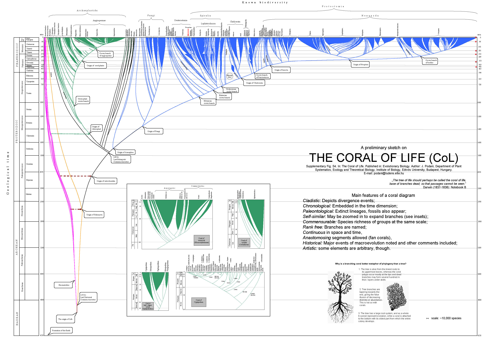
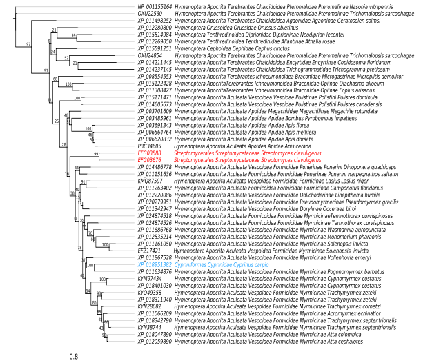
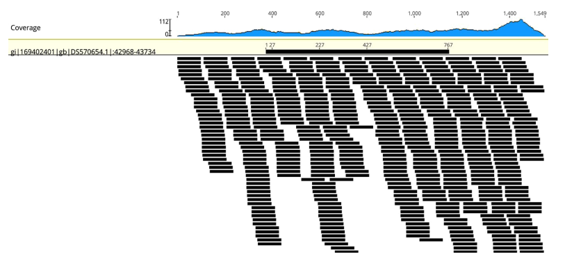
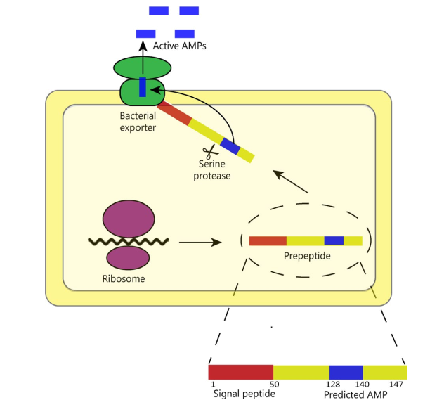
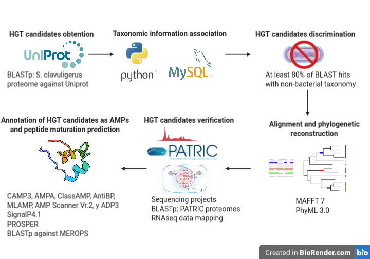

[ Publication](https://onlinelibrary.wiley.com/doi/10.1002/ece3.4924){.btn target=_blank} [ Oral presentation (English)](https://www.youtube.com/watch?v=JEuAOEzI58Y&t=1156s){.btn target=_blank} [ Slides (English)](https://www.researchgate.net/publication/354368567_In_silico_detection_of_horizontal_gene_transfer_in_Streptomyces_clavuligerus){.btn target=_blank} [ Slides (Spanish)](https://www.researchgate.net/publication/354369575_Deteccion_in_silico_de_un_peptido_antimicrobiano_AMP_transferido_horizontalmente_de_artropodos_a_bacterias){.btn target=_blank}

I worked on this project during a summer research internship in 2018 at the [Bio-Chemoinformatics Group][bio_chemoinformatics] - Universidad de Las Américas, in Ecuador. 

## Summary 

*Streptomyces clavuligerus* is a Gram-positive bacterium that is a high producer of secondary metabolites with industrial applications. The production of antibiotics such as clavulanic acid or cephamycin has been extensively studied in this species; nevertheless, other aspects, such as evolution or ecology, have received less attention. Furthermore, genes that arise from ancient events of lateral transfer have been demonstrated to be implicated in important functions of host species. Considering the importance of **HGT events** in the life history, the branching coral of life metaphor has been proposed, instead of the traditional three scheme. 

  

::: {.gray-italic .center-text}
**Figure 1.-** The prototype of the Coral of Life. Retrieved from [Podani, 2019, Evolutionary Biology][podani_2019].
:::

Thus, we studied the impact of HGT in the *S. clavuligerus* genome. To perform this task, we applied **whole-genome analysis** to identify laterally transferred sequences from different domains. The most relevant result was a putative **antimicrobial peptide** (AMP) with a clear origin in the Hymenoptera order of insects. 

  

::: {.gray-italic .center-text}
**Figure 2.-** Phylogenetic tree of *Streptomyces clavuligerus* ATCC 27064 Hymenoptera antimicrobial peptide-like proteins and their homologs. Proteins from bacteria are represented in red, the sequence from Hymenoptera insects are colored in black, and blue highlights the Cyprinus carpio (Chordata) sequence. IDs of sequence and their taxonomy can be observed in terminal nodes.
:::

Next, we determined that two copies of these genes were present in the **megaplasmid pSCL4** but absent in the *S. clavuligerus* ATCC 27064 chromosome. Additionally, we found that these sequences were exclusive to the ATCC 27064 strain (and so were not present in any other bacteria) and we also verified the expression of the genes using **RNAseq data**. 

  

::: {.gray-italic .center-text}
**Figure 3.-** Mapping of the scaffold DS570654 (region from 42,968 to 43,734) of *Streptomyces clavuligerus* ATCC 27064 using RNAseq data (GSE104738).
:::

Next, we used several **AMP predictors** to validate the original annotation extracted from Hymenoptera sequences and explored the possibility that these proteins had post-translational modifications using peptidase cleavage prediction. We suggest that Hymenoptera AMP-like proteins of *S. clavuligerus* ATCC 27064 may be useful for both species adaptation and as an antimicrobial molecule with industrial applications.

  

::: {.gray-italic .center-text}
**Figure 4.-** Proposed scenario for the cleavage and secretion of AMPs from EFG03588 and EFG03676 (Hymenoptera AMP-like proteins).
:::

A summary of the methods applied in this study is presented below: 

  

## Citation 

**Ayala‐Ruano, S.**, Santander‐Gordón, D., Tejera, E., Perez‐Castillo, Y., & Armijos-Jaramillo, V. (2019). **A putative antimicrobial peptide from Hymenoptera in the megaplasmid pSCL4 of *Streptomyces clavuligerus* ATCC 27064 reveals a singular case of horizontal gene transfer with potential applications**. *Ecology and Evolution*, 9 (5), 2602-2614. doi: [10.1002/ece3.4924][ayala2019].

[bio_chemoinformatics]: https://www.udla.edu.ec/investigacion/grupos-de-investigacion/bio-quimio-informatica/
[podani_2019]: https://link.springer.com/article/10.1007%2Fs11692-019-09474-w
[ayala2019]: https://onlinelibrary.wiley.com/doi/full/10.1002/ece3.4924
