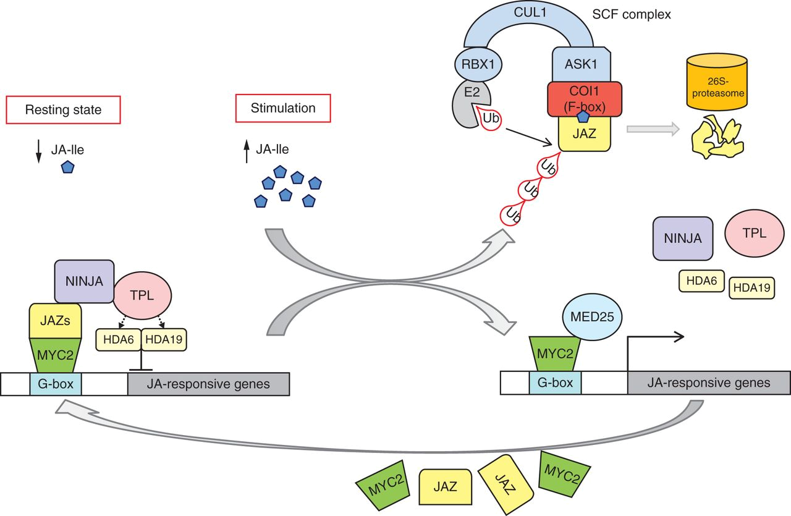
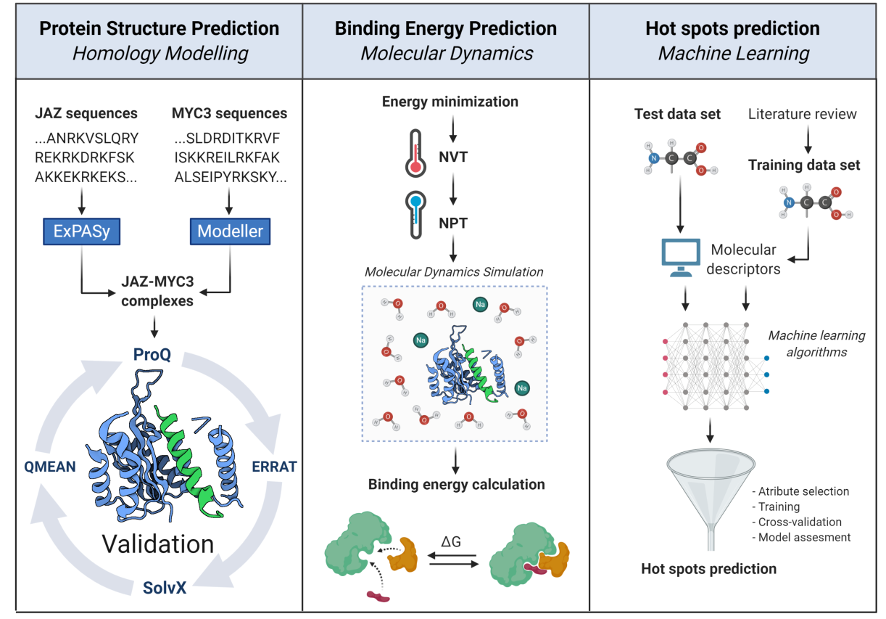
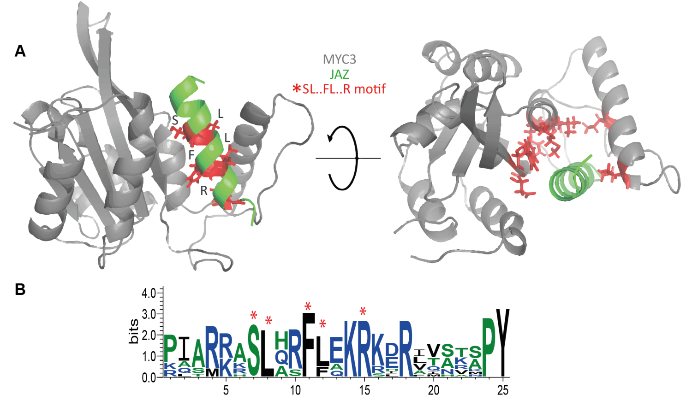
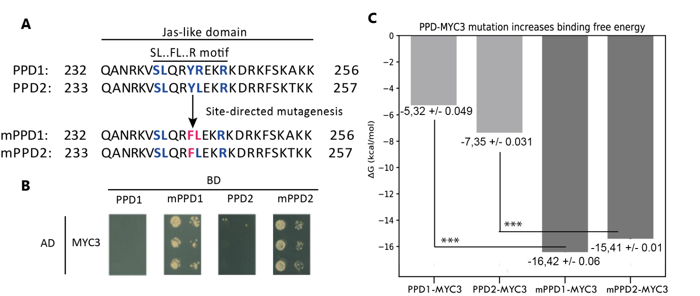

[ Publication](https://www.frontiersin.org/articles/10.3389/fpls.2020.01139/full){.btn target=_blank} [ Oral presentation (Spanish)](https://www.youtube.com/watch?v=NqamWg_24p4){.btn target=_blank} [ Oral presentation (English)](https://www.youtube.com/watch?v=Ukw7HhBRvmo&t=14675s){.btn target=_blank} 

[ Slides (Spanish)](https://www.researchgate.net/publication/354365990_Modelamiento_de_la_interaccion_proteina-_proteina_y_busqueda_de_residuos_clave_por_aprendizaje_automatico_del_complejo_JAZ-_MYC3_de_Arabidopsis_thaliana){.btn target=_blank} [ Slides (English)](https://www.researchgate.net/publication/356102435_The_molecular_basis_of_JAZ-MYC_coupling_a_protein-protein_interface_essential_for_plant_response_to_stressors){.btn target=_blank} [ Poster (Spanish)](https://www.researchgate.net/publication/354369932_Modelamiento_de_la_interaccion_proteina-proteina_y_busqueda_de_residuos_clave_por_aprendizaje_automatico_de_un_complejo_de_proteinas_en_la_ruta_del_acido_jasmonico_en_Arabidopsis_thaliana){.btn target=_blank}

I worked on this project during my bachelor, collaborating as an undergraduate researcher at the [Computational and Theoretical Chemistry Group][ctc_group] - Universidad San Francisco de Quito, in Ecuador. 

## Summary 

The **jasmonic acid** (JA) signaling pathway is one of the primary mechanisms that allow plants to respond to a variety of biotic and abiotic stressors. Within this pathway, the **JAZ repressor proteins** and the basic helix-loop-helix (bHLH) **transcription factor MYC3** play a critical role. JA is a volatile organic compound with an essential role in plant immunity. The increase in the concentration of JA leads to the decoupling of the JAZ repressor proteins and the bHLH transcription factor MYC3 causing the induction of genes of interest. 

  

::: {.gray-italic .center-text}
**Figure 1.-** JA perception via the COI1–JAZ co-receptor complex – mechanisms in JA-induced gene expression. Retrieved from [Wasternack & Hause, 2013, Annals of Botany][wasternack_2013].
:::

The primary goal of this study was to identify the molecular basis of JAZ-MYC coupling. For this purpose, we modeled and validated 12 JAZ-MYC3 3D in silico structures and developed a molecular dynamics/machine learning pipeline to obtain two outcomes. First, we calculated the average free binding energy of JAZ-MYC3 complexes, which was predicted to be -10.94 +/-2.67 kJ/mol. Second, we predicted which ones should be the interface residues that make the predominant contribution to the free energy of binding (**molecular hotspots**). 

  

::: {.gray-italic .center-text}
**Figure 2.-** In silico workflow proposed to unravel structural, energetic, and molecular features of JAZ-MYC3 complexes. The pipeline is divided into three stages: protein homology modeling, binding energy calculation, and molecular hotspots discovery.
:::

The predicted protein hotspots matched a conserved linear motif SL••FL•••R, which may have a crucial role during MYC3 recognition of JAZ proteins. 

  

::: {.gray-italic .center-text}
**Figure 3.- A)** Spatial location of the SL.FL.R motif in the JAZ-MYC3 complex. Red sticks represent the small binding motif. **B)** Multiple sequence alignment logos representation of the Jas domain. Red asterisks denote the position of the SL.FL.R motif.
:::

As a proof of concept, we tested, both in silico and in vitro, the importance of this motif on PEAPOD (PPD) proteins, which also belong to the TIFY protein family, like the JAZ proteins, but cannot bind to MYC3. By mutating these proteins to match the SL••FL•••R motif, we could force PPDs to bind the MYC3 transcription factor. Taken together,modeling protein-protein interactions and using machine learning will help to find essential motifs and molecular mechanisms in the JA pathway.

  

::: {.gray-italic .center-text}
**Figure 4.-** Site-directed mutagenesis assay of PPD-MYC3 complexes. **A)** Amino acid alignment showing changes in the Jas-like domain of PPD1, PPD2, and mutants mPPD1 and mPPD2. **B)** Yeast-two hybrid experiments are showing the favorable change in affinity upon mutation of the SL.FL.R motif in PPD1 and PPD2. **C)** Predicted free binding energy of PPD1, PPD2, and mPPD1, mPPD2 mutants.
:::

## Citation 

Oña-Chuquimarca, S., **Ayala-Ruano, S.**, Goossens, Pauwels, L., Goossens, A., Leon-Reyes, A., & Méndez, M. A (2020). **The molecular basis of JAZ-MYC coupling, a protein-protein interface essential for plant response to stressors**. Frontiers in Plant Science, 11, 1139. doi: [10.3389/fpls.2020.01139][article].

This article was chosen to feature in the Frontiers in Plant Science 2020 highlights e-book collection. doi: [10.3389/978-2-88966-723-9][ebook]. 

[ctc_group]: https://www.usfq.edu.ec/en/research/grupo-de-quimica-computacional-y-teorica
[wasternack_2013]: https://academic.oup.com/aob/article/111/6/1021/151869
[ona_chuquimarca_2020]: https://www.frontiersin.org/articles/10.3389/fpls.2020.01139/full
[article]: https://www.frontiersin.org/articles/10.3389/fpls.2020.01139/full
[ebook]: https://www.frontiersin.org/books/Frontiers_in_Plant_Science_2020_Highlights/3910
