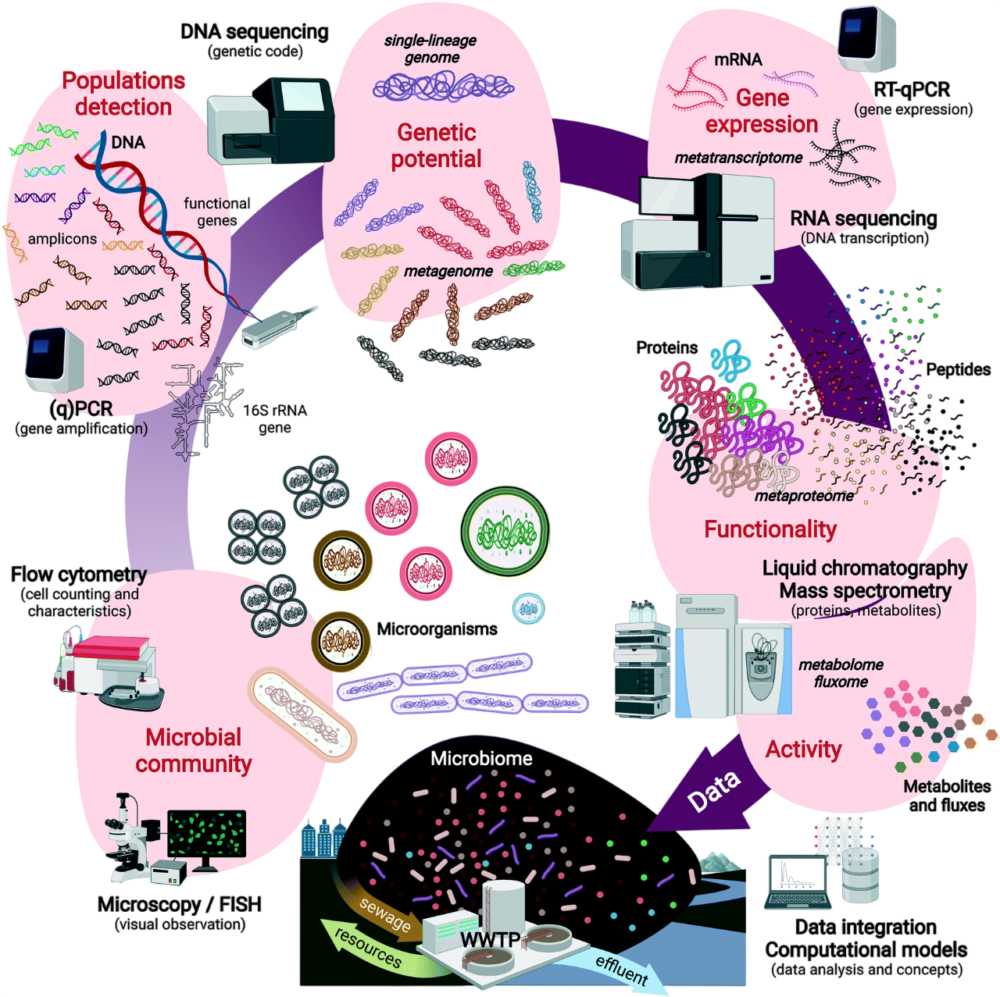
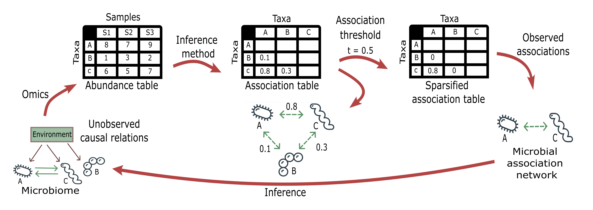

[ Source code][source-code]{.btn target=_blank} 
[ Web application][web-app]{.btn target=_blank}
[ Software archive][soft-arch]{.btn target=_blank}
[ Thesis Defense Slides (English)][thesis-defense-slides]{.btn target=_blank} 
[ CCS Slides (English)][ccs-slides]{.btn target=_blank}

I developed this project for my master's thesis from the [MSc in Systems Biology][sysbio] at the [Multiomics Network Analytics Group (MoNA)][Mona] - [Novo Nordisk Foundation Center for Biosustainability (DTU Biosustain)][Biosustain].

## Background

**Wastewater treatment (WWT)** is the process of removing contaminants from used water before it is discharged back into the environment, which contributes to address water scarcity and to protect aquatic ecosystems. Recent advances in high-throughput omics technologies have facilitated the study of **microbiomes** from complex environmental samples such as WWT. A comprehensive study of an environmental microbiome requires integrating data from various studies and **meta-omics** technologies, as well as biological knowledge to interpret these data.

  

::: {.gray-italic .center-text}
**Figure 1.-** Multi-stage molecular investigations of microbiomes in environmental biotechnology from microorganisms to DNA, RNA, proteins, metabolites and their fluxes. Designed by Cerruti, et al., 2021, Env Science: Water Research & Technology.
:::

In this project, we investigated the microbiome of the WWT process to build **MicW2Graph**, an open-source **knowledge graph** that integrates **metagenomic and metatranscriptomic** information with their **biological context**, including biological processes, environmental and phenotypic features, chemical compounds, and additional metadata. We developed a workflow to collect meta-omics datasets from [MGnify][Mgnify] and infer potential interactions among microorganisms through **microbial association networks (MANs)**. 

  

::: {.gray-italic .center-text}
**Figure 2.-** Workflow to infer microbial association networks (MANs) from meta-omics datasets.
:::

MicW2Graph enables the investigation of research questions related to WWT, focusing on aspects such as **microbial connections, community memberships, and potential ecological functions**. The following figure shows the general workflow of the MicW2Graph project:

  

::: {.gray-italic .center-text}
**Figure 3.-** Schematic summary of the methods for the MicW2Graph project. The workflow was divided into six stages: data collection and preprocessing, exploratory data analysis, inference of microbial association networks (MANs), knowledge graph (KG) creation, network analysis, and web application development.
:::

## Data

WWT meta-omics studies were queried from the **MGnify API** using experiment type and biome parameters. Further filters were applied based on experimental and taxonomic criteria. The abundance tables from the filtered studies were then grouped by **biome** and **experiment type** to infer **MANs**. 

The workflow for retrieving and filtering WWT meta-omics studies from MGnify is summarized in the diagram below:

  

::: {.gray-italic .center-text}
**Figure 4.-** Workflow for retrieving and filtering wastewater treatment meta-omics studies from MGnify.
:::

The code to retrieve the data from MGnify is available in this [GitHub repository][retrieve_info_mgnify].

## Exploratory data analysis

A general overview of the filtered studies was provided through various plots, describing the number of studies and samples, experiment types, sampling countries, sub-biomes, and other relevant metadata.

The exploratory data analysis was encapsulated in a **module of the MicW2Graph web application**, containing a **general overview of all studies**, **studies by sub-biomes**, **individual studies**, and a section for conducting **pairwise comparisons between studies**.

  

::: {.gray-italic .center-text}
**Figure 5.-** Exploratory data analysis module of the MicW2Graph web application.
:::

## Microbial association networks (MANs)

MANs are **weighted and undirected networks**, defined as *G = (V, E)*, where *V* is a set of nodes and *E* is a set of edges. Nodes in these networks are Operational Taxonomic Units at a specific taxonomic level, while **edges indicate substantial co-presence (positive interaction) or mutual exclusion (negative interaction) trends** in microorganism abundances across samples. 

**Weights** in MANs correspond to association values among species defined by the inference method, and there is an edge between two nodes if this number is greater than or equal to a given cutoff *t*. 

In this project, we selected the [Correlation inference for Compositional data through Lasso (CCLasso)][CCLasso] method. Network inference was conducted using the [NetCoMi][NetCoMi] R package. 

  

::: {.gray-italic .center-text}
**Figure 6.-** Microbial association networks module of the MicW2Graph web application.
:::

The code for the network inference and analysis of MANs is available in this [GitHub repository][net_inf_analysis].

## MicW2Graph

MicW2Graph incorporates the **MANs with the optimal association threshold for each WWT sub-biome and experiment type**, the **biological context** of the species within the MANs, and **ontologies** that standardize and expand the information of this resource. This KG comprises **1247 nodes and 9749 relationships**, categorized into 12 node labels and 8 relationship labels. The relationships in MicW2Graph are classified as taxonomic, functional, and data-driven, reflecting the different layers of knowledge available in the KG.

The MicW2Graph **metagraph** and a snapshot of the graph database with nodes and edges for all sub-biomes and experiment types are shown below:

  

::: {.gray-italic .center-text}
**Figure 7.-** MicW2Graph metagraph illustrating the schema of the knowledge graph (KG) and visualization of the MicW2Graph KG displaying all nodes and edges, colored according to the metagraph conventions.
:::

  

::: {.gray-italic .center-text}
**Figure 8.-** Knowledge graph module of the MicW2Graph web application.
:::

## Case studies

The use cases demonstrate the **potential of MicW2Graph to discover new species associated with WWT biological processes**, showing how the available information of well-known species can help to predict potential functions and traits for less studied species. These species and communities can be further investigated as potential candidates to optimize the bioremediation process. 

  

::: {.gray-italic .center-text}
**Figure 9.-** Case studies module of the MicW2Graph web application.
:::

## Additional information

The source code for the MicW2Graph project is available in this [GitHub repository][source-code]. The web application is freely available at this [link][web-app]. The software archive with the code and data of the project is available at this [Zenodo link][soft-arch].

## Citation 

**Ayala-Ruano, S.**, Luu Phanthanourak, A., Reverenna, M., Palleja Caro, A., & Santos, A. (2024). **MicW2Graph: Building a knowledge graph of the wastewater treatment microbiome and its biological context** (Version 1.0.0) [Software]. *Zenodo*. doi: [doi.org/10.5281/zenodo.113946188][soft-arch].

[source-code]: https://github.com/Multiomics-Analytics-Group/MicW2Graph
[web-app]: https://micw2graph.streamlit.app/
[soft-arch]: https://zenodo.org/doi/10.5281/zenodo.11394618
[thesis-defense-slides]: https://doi.org/10.5281/zenodo.12511100
[ccs-slides]: https://doi.org/10.5281/zenodo.16965571
[who_amr]: https://www.who.int/news-room/fact-sheets/detail/antimicrobial-resistance
[sysbio]: https://www.maastrichtuniversity.nl/education/master/systems-biology
[Mona]: https://multiomics-analytics-group.github.io/
[Biosustain]: https://www.biosustain.dtu.dk/
[Mgnify]: https://www.ebi.ac.uk/metagenomics/
[retrieve_info_mgnify]: https://github.com/Multiomics-Analytics-Group/Retrieve_info_MGnifyAPI
[CCLasso]: https://github.com/huayingfang/CCLasso
[NetCoMi]: https://github.com/stefpeschel/NetCoMi
[net_inf_analysis]: https://github.com/Multiomics-Analytics-Group/Microbial_network_inference_and_analysis_MicW2Graph
