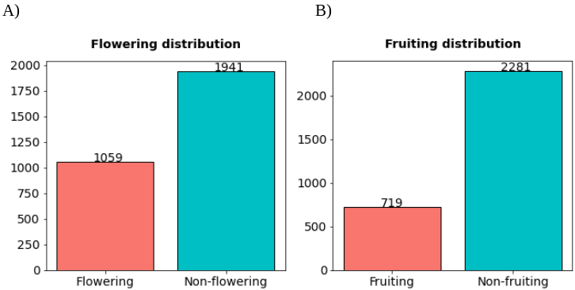
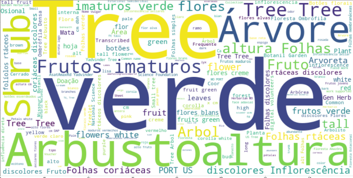
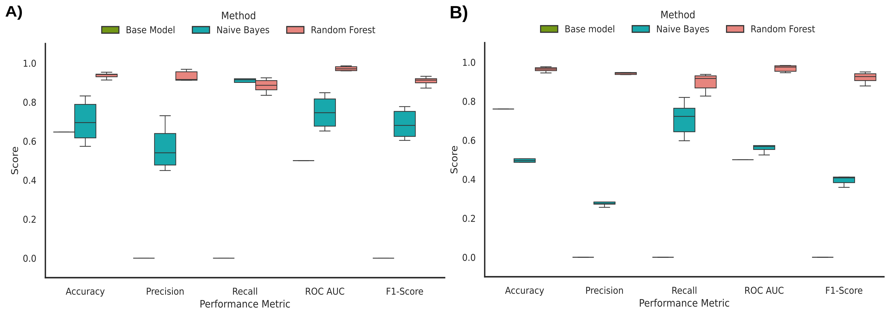
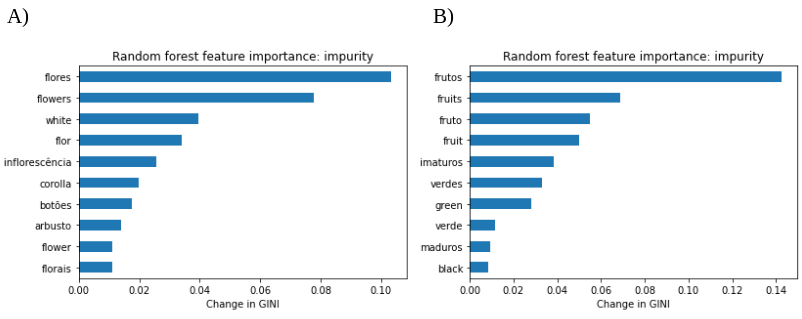

[ Source code](https://github.com/sayalaruano/Phenology_from_herbarium_records){.btn target=_blank}

I contributed to this project as part of my work as **data scientist consultant** at Universidad de las Américas, in Ecuador.

## Summary

The initial species list comprised 636 unique names, which were filtered to delete duplicates and records identified at a genus level. The final list comprised 438 accepted names verified based on the Checklist of the Vascular Plants of the Americas (CVPA), publicly available on a website on the [Missouri Botanical Garden database Tropicos][tropicos]. Then, we used the taxize R package to retrieve synonyms reported on the Tropicos database, obtaining a list of 2,823 records of the original species and their synonyms.

We looked for herbarium records from our list in the [Global Biodiversity Information Facility - GBIF][gbif]. We used the GBIF API to automate the searches, implemented with in-house Python scripts. Then, we applied some filters to get only preserved herbarium specimens with information about latitude and longitude coordinates, dates with at least the month, locations from American tropical areas, field notes, and no geospatial issues. The resulting dataset had 68,114 records from 424 species with at least one of the columns with field notes information. After applying a preprocessing pipeline and removing duplicates, we obtained a final dataset of 53,793 records. In the final dataset, we manually assigned the synonyms in the scientific names column to the accepted names according to the CVPA.

We created a validation dataset of 3,000 records to get an estimation of the performance metrics of the machine learning models. The records for the validation dataset were selected by applying a stratified sampling considering the variables of year, latitude, and longitude of all records that had links to images. Then, we manually labeled the flowering and fruiting conditions of these records by reading their field notes and observing their linked images.

::: {.gray-italic .center-text}
**Figure 1.-** Proportions of flowering and fruiting labels of the validation dataset.
:::

Before creating the machine learning models with the validation dataset, we applied a preprocessing pipeline to the field notes. First, we removed the punctuation, numbers, special symbols, and certain repetitive expressions that were not informative (i.e., “na”, “ca”, “PORT US”, etc.). Then, we used the [Natural Language Toolkit][nltk] Python package to delete the stop words from different languages, including Spanish, English, Portuguese, and French.

::: {.gray-italic .center-text}
**Figure 2.-** Word cloud of the words from the fieldnotes of the validation dataset after preprocessing.
:::

Machine learning algorithms usually require matrices of numbers as their input, so we converted our text data from field notes into a numerical matrix using the “bag of words” method using the *CountVectorizer* function from the [scikit-learn Python package][scikit_learn]. 

We created six different models to predict the flowering and fruiting stages of plants considering field notes data. First, we created base models for flowering and fruiting using the scikit-learn “DummyClassifier” function, which were simple classifiers that always predicted the most frequent class in the data. Then, naïve Bayes and random forest algorithms were applied for the same purposes. We observed that random forest models had the best performance metrics for both flowering and fruiting, showing values greater than 90% on most of the performance metrics.

::: {.gray-italic .center-text}
**Figure 3.-** Performance metrics of A) flowering and B) fruiting models.
:::

Random forest algorithms allow an estimation of the importance of their parameters, which is known as feature importance. These results demonstrated that the features that provide more information to the model are the ones that summarize the phenology information from field notes.

::: {.gray-italic .center-text}
**Figure 4.-** Feature importance of A) flowering and B) fruiting random forest models.
:::

Finally, we made the predictions of flowering and fruiting from the field notes of the final dataset using the random forest models created in the last section. These models and results can be used to design conservation strategies of the tropical forest species.

## Additional information

A research article was submitted to a scientific journal with the results of this project. The article is currently under review and will be published soon.

[tropicos]: http://tropicos.org/Project/VPA
[gbif]: https://www.gbif.org/
[nltk]: https://www.nltk.org/
[scikit_learn]: https://scikit-learn.org/
