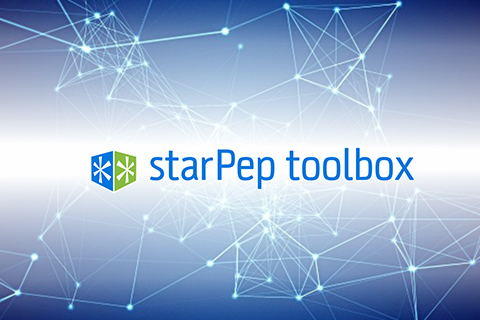
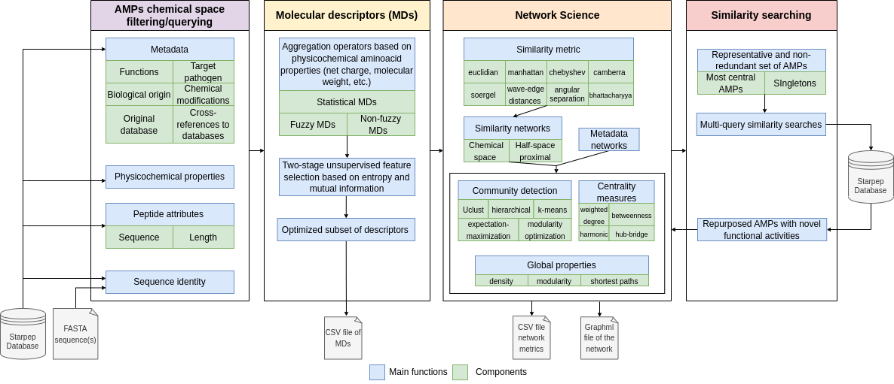

[ Publication][pub-link]{.btn target=_blank}
[ Source code][source-code]{.btn target=_blank}
[ Documentation][docs-link]{.btn target=_blank} 

I contributed to this project as part of my work as research assistant at the **Applied Signal Processing and Machine Learning Group** and the **Grupo de Medicina Molecular y Traslacional** - Universidad San Francisco de Quito, in Ecuador.

## Summary

**Antimicrobial peptides** (AMPs) are small bioactive chemicals that have appeared as promising compounds to treat a wide range of diseases. The effectiveness of AMPs resides in the wide range of mechanisms they can use for both killing microbes and modulating immune responses. However, the **AMPs’ chemical space** (AMPCS) is huge, it is estimated that there exist more than *10^65* unique sequences of peptides with 50 residues or fewer, which represent a big challenge for the discovery of new promising sequences and the identification of common features, motifs, or relevant biological functions shared by these peptides. Therefore, we developed [StarPep toolbox][source-code], an **open-source software** to study the AMPCS using **networks, clustering, and similarity-searching models**, which can contribute to peptide drug repurposing, development, and optimization.

  

::: {.gray-italic .center-text}
**Figure 1.-** StarPep Logo.
:::

This tool was developed as a **Java desktop application** that integrates the functionalities of several open-source projects. The graphical user interface was built on top of the [NetBeans Platform][netbeans], using the *Java SE Runtime Environment 8*. The graph database structure was implemented with the [Neo4j][neo4j] platform. Some visualization features and the calculation of network properties were based on [Gephi][gephi]. The sequence alignment algorithms were implemented using the [BioJava][biojava] API. 

The AMPs were collected from a large variety of biological data sources to be organized into an integrated graph database called [starPepDB][starpepdb], composed of *45.120 AMPs* and their metadata. This integrated graph database is embedded into StarPep toolbox to enable end-user querying, filtering, visualizing, and analyzing the AMPs, taking advantage of network-based representations.

The main modules of StarPep toolbox are listed below:

* **AMPs' chemical space filtering:** Obtain a subset of AMPs from the StarPepDB using their metadata (function, target pathogen, biological origin, chemical modifications, original database, and cross-referenced entries to PDB, PubMed, and UniProt).

* **Molecular descriptors:** Calculate molecular descriptors of the AMPs by applying statistical and aggregation operators on physicochemical amino acid properties (e.g., net charge, isoelectric point, molecular weight, etc.).

* **Network Science:** Build different types of networks (metadata, chemical space, and half-space proximal) and calculate global/local properties, centrality metrics, communities, among other metrics.

* **Similarity searching:** Create multi-query similarity searching models that can lead to the repurposing of AMPs with novel functional activities.

The figure below shows the software architecture and components of StarPep toolbox: 

  

::: {.gray-italic .center-text}
**Figure 2.-** StarPep modules and components. The software has four main modules to load and filter AMPs, calculate MDs, create and analyze networks, and develop multi-query similarity-searching models.
:::

For more details about the software, read its [online User Guide](https://grupo-medicina-molecular-y-traslacional.github.io/StarPep_doc/) and [publication][pub-link]. Also, you can check the [source code][source-code] to explore the implementation of the software.

## Citation

Aguilera-Mendoza, L., **Ayala-Ruano, S.**^, Martinez-Rios, F., Chavez, E., García-Jacas, C. R., Brizuela, C. A., & Marrero-Ponce, Y. (2023). **StarPep Toolbox: an open-source software to assist chemical space analysis of bioactive peptides and their functions using complex networks**. *Bioinformatics*, 39 (8), btad506. doi: [doi.org/10.1093/bioinformatics/btad506][pub-link].

^co-first author

[pub-link]: https://doi.org/10.1093/bioinformatics/btad506
[source-code]: https://github.com/Grupo-Medicina-Molecular-y-Traslacional/StarPep
[docs-link]: https://grupo-medicina-molecular-y-traslacional.github.io/StarPep_doc/
[netbeans]: https://platform.netbeans.org/
[neo4j]: https://neo4j.com/
[gephi]: https://gephi.org/
[biojava]: https://biojava.org/
[starpepdb]: https://doi.org/10.1093/bioinformatics/btv180
